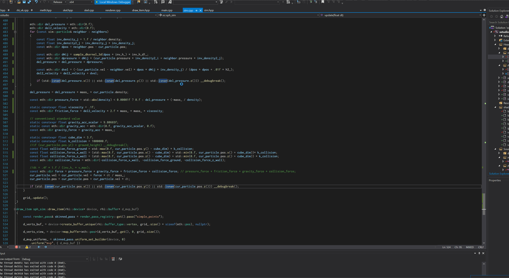

# xstudio

graphics engine type of thing for experimentation/classes
* vulkan-based, c++20
* skeletal animation in skel(.hpp/.cpp), cloth sim, sph fluid sim in sim(.hpp/.cpp)
* WIP gpu scripting language in script/script(.hpp/.cpp) 

(I was never really able to get the fluid particle sim working, for some reason it just looks a little off)