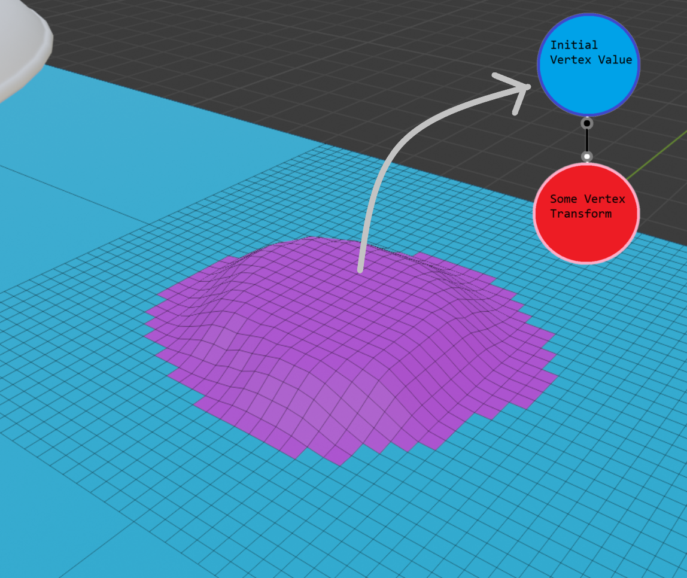

# xstudio
*long readme warning*

One of the things I've been interested recently is using a functional representation to defining models. Using this representation, 2D/3D models are
defined by using "functions" to define, transform, merge, and/or perform other manipulations on a model. A nice example of a project using this
representation is [a literal programming language](https://www.mattkeeter.com/projects/kokopelli/) for defining 3D models. 

I think the functional representation is actually a pretty powerful way of defining models in creative software. For example, the standard
transaction stack system used in most creative software can be thought of as a version of functional representation. If each individual 
transaction is thought of as a "function" taking in an input and a few parameters and transforming it into an output, a stack of transactions could
really be thought of as a bunch of functions transforming the data. Under the functional representation, a transaction in Photoshop to increase the saturation of 
an image by 20% would be thought of as a saturate() function taking in the input image and a second parameter (percentage = 20%). Even more 
complex transforms like mesh sculpting could also be thought of as functions: for example, the standard 
"[Draw](https://docs.blender.org/manual/en/latest/sculpt_paint/sculpting/tools/draw.html)" sculpting tool  found in most sculpting applications 
could be thought of as a function sculpt_draw() taking in the original model vertices and an array of scalars representing the displacement for each 
vertex along its average normal and outputting the sculpted mesh.

Directly exposing the functional representation of an artist's edits in the UI of a program has several benefits, and in general I think it 
is becoming a bit of a trend in the animation and 3D/2D modelling communities. It's not just the idea that the transaction stack is actually a
series of transforms that can be represented as functions, but more generally that art can be "programmed"; that the "style" of the art can be 
reduced to a set of functions and a few parameters that can be tweaked and easily iterated over to get the desired result. A good example of 
how the "style" of art can be reduced to a few functions can be seen in [Stop Drawing Dead Fish](https://vimeo.com/64895205), where fish
could be programmed how to react to a performer's hand movements on a tablet. They could move straight to the finger's position, follow smoothly,
or have a jump to finger but overshoot type behavior. While the tool in the presentation was very good for improvised performances, in my opinion
a better way to adapt the tool for production animation workflows would be to make a virtual "finger" follow a spline with a few controllable
points which could be adjusted. This way the entire animiation, from the general path an object takes to the specifics of how an object follows
that path, could be easily adjusted and refined to get what the artist desires.

In general, the benefits of exposing the full functional representation are:
 * Reduced unnecessary iteration: If you changed the contrast of an image and then added a film-like filter, but then wanted to go back
 to see how the image would look like if the initial contrast setting was different, things would be difficult. You would have to undo, change 
 the contrast, then re-apply the filter. If the full transform stack was exposed in the UI, then all the user would have do is adjust the 
 contrast amount parameter in the transform stack list.
 * Variants: In a similar vein, say an artist was sculpting a head and made the nose, ears, eyes, etc. in different transactions (or even 
 transaction groups). Ideally, it would be possible to replace one of these transactions to try out a different nose on the character or 
 mix-and-match facial features.
 * Apply a similar style across art: This maybe isn't the case for sculpting applications, but if say an artist develops an effect for one image
 and wants to apply it to a set of images, the stack of functions used could simply be applied to the rest of the images since the workflow is 
 data-independent. Could also apply kind of to 3D-modelling or animation - if the transforms are generic enough the movement style
 of a rabbit in an animation could be translated to the movement of a dog or something.
 * Procedural geometry: If you think about it, procedural geometry is just a bunch of functions creating a model from a random seed, so it is 
 similar to the stuff described above except for the fact that there is absoultely no human control (but one could argue that the program used to
 create the prodedural stuff is the human controlled part). Obviously in production this has its downsides as most animations want everything to
 be actually controllable, but it would help for very large crowd simulations/other similar problems.

## the project

So what's the next step in the evolution of this model? Is it possible to give artists further control? Is it possible to use this model to
create an application to simplify and unify 3D modelling/animation workflows and to reduce the vast amounts of code that go into creating these 
softwares?

Maybe.

If I were to compare the current state of creative tools using the functional transform stack representation to the original functional 
programming language, LISP, what current software is missing is introspection. One of the major features of LISP is that executable instructions
can be processed similarly to data. Taking this idea over to software, what artists are missing is not just complete control over their
art, but complete control over their tools. If the transform stack is thought of as the "instructions," artists should be given the means to 
create transforms to modify the "instuctions" just as they would modify any other set of data. These meta-instuctions could be mapped to run when,
say, a key is pressed or a control is dragged.

Here's the second thought: Since artists could be thought of at this point as modifying the transform stack instead of the actual data, what would it be like to replace
the data with the stack? Maybe like this:

Where each vertex has it's own transform stack! Obviously tying the instructions to the data has it's downsides, but here sculpting tools would
work as usual, simply adding to each vertex's transform stack and modifying the parameters. Per-vertex transforms resulting from Skeletal mesh 
deformations could also be defined this way, with each vertex being deformed having a transform in it's stack that refers to the bones and 
weights driving it. Plus it leads to some cool visualizations.

A few things to still figure out with this method:
 * How would model textures/colors be manipulated?
 * How would you design a system to generate new vertices (and by extension new transform stacks)?
 * How would infinitely detailed surfaces be represented (ex. subdivision surfaces)

## comparisons to other software

This model actually shares some similarities to the models used by video editors and other, more advanced, sequencing tools such as Unreal's 
sequencer and OpenTimelineIO:

Here, the scene can be seen as a bunch of transforms that take in time and some time-varying data as the input and produce the evaluated data
at the specified time as an output. Moreover, these evaluations can be blended and transformed in other ways on top of the initial evaluation.
Using this representation, each discrete frame can be seen as having its own transforms to evaluate, similarly to how each discrete vertex 
had its own transform stack to evaluate. The difference from the previous modelling example is that (most) evaluations don't have any dependencies and 
therefore can be done in any order (assuming the scene is deterministic and doesn't reqire data from the previous frame). I guess this means that
the transform "stack" would be better defined as an evaluation "graph," but to keep things simple I'll stick to the stack-based representation
for now. Even the visualizations look similar; each type of transform is given it's own color and they can be seen as "layers".

## implementation

For implementation specifics, the representation fits nicely into an entity-component system with an evaluation graph. For the ECS i'm using entt.
In order to handle tools scripting, I wanted to use a graphical scripting language but those take a while to both design and develop. The ideal
model would be something where the keyboard and mouse show up in the upper left hand corner of the screen and the user could drag lines from
each key/mouse button to functions that would create transforms, manipulate transforms/transform parameters, and a final function that would 
take in the initial transform stack and produce another transform stack that would add the new transform if its type isn't already at the
top or most recent position and modify it otherwise. Transforms themselves could simply be defined as functions taking in data and parameters

Because graphical scripting languages are hard, I'll probably start off with a functional beginner-friendly text-based programming language; the first one
that pops into mind is [pyret](https://www.pyret.org/). However, I would like for there to be a few changes: Pyret has a few nice features for
"reactive" programs; Reactors in Pyret allow for a program to specify functions to run on every tick, when a key is pressed, etc. However, there
are a few problems with this system: 
 * Sometimes, there are cases when multiple things would need to be true. In, say, a mesh painting mode, a texture painting tool would depend on
 several user inputs. One UI control to control whether texture painting or geometry painting is enabled, a check to see whether the mouse 
 position ray cast into the scene hits a mesh, and a final check to see whether mouse button 1 is actually down. Binding to changes in any of these
 states would make things unnecessarily difficult. Artists (or ok, maybe im being optimistic that artists would be doing this) would have to 
 hook into callbacks for all the state changes they want to check, then hook into another callback in the reactor when only one of these states 
 change (on-mouse), and finally check if the rest of the conditions are true to run the program. Maybe programmers are familiar with this.
 * Sometimes, it might be better to split editing operations up. This is maybe a controversial opinion, but I personally believe that splitting 
 editing operation types into modes helps reduce conceptual load and helps organize tools better, even if in some cases it might not be super
 intuitive to be swapping modes to operate on the same data in different ways. In pyret-speak, this would mean having the ability to specify 
 multiple reactors and be able to set them as active or not active. Unreal engine has something similar with edit modes, where viewport editing
 tools can extend a UEdMode/FEdMode class and implement OnTick/Render/OnActorSelected/etc methods to implement viewport editing operations. You 
 could also implement an IsCompatibleWith method to specify which edmodes this ed mode is compatible with when it is active.

A more opportunistic way to handle this might be to use a "When" statement, like maybe similar to what is done in [Dynamicland](https://dynamicland.org/), 
but really not at all and completely missing the point of the original. I really like Dynamicland's system of whens/claims/wishes and maybe 
I'll figure out a way to match this model to my system later, but for now I feel like they're not really super compatible. In my head, a tool node 
would have one main section of code with no special fluff that would run continuously, except it wouldn't even be labelled on-tick, it would 
just be kind of like writing a simple script in python - no main method needed. Then, there would be sections labelled (for example) 
"When is_texture_painting and mouse_intersects_object and mouse_1_down" and code in those sections would be run when the conditions are true. 
Actually, I'm kind of stupid: since all the code in the node would be running per tick, these could just be if statements. Also, these nodes 
would have to have a way of being active. There could be things like super-if statements that would check for conditions in UI to be true (like
maybe checking a nodes list), but the list could also just be a built-in feature like it is in Unreal with EdModes.

## applications to other software

Each vertex can be thought of as its own computer, maybe some applications to VLSI and programming very large systems. The use of very 
large systems as a powerful visualization tool as seen in [Stephen Wolphram's](https://arxiv.org/ftp/arxiv/papers/2004/2004.08210.pdf) 
([article](https://tinyurl.com/y2p7qav3))(ok, kind of sketch research but still kind of cool) work and 
[Misha Mahowald](http://www.ini.uzh.ch/~tobi/papers/mishathesis.pdf). 
